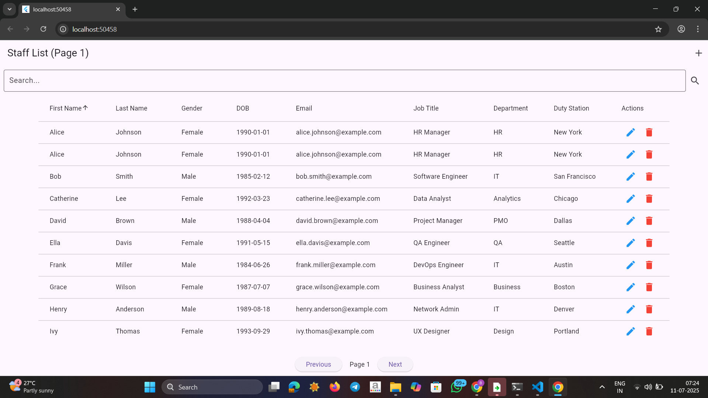
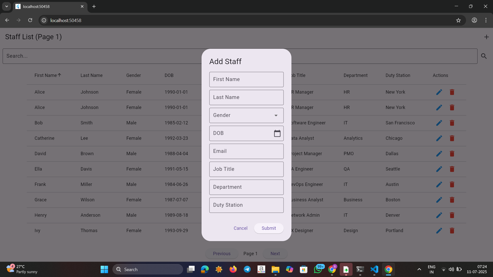

# 📋 Staff Management Web App

A responsive CRUD app to manage staff records using **Flutter (Web)** as the frontend and **FastAPI** as the backend with SQLite for lightweight data storage.

---

## 🚀 Features

- 🔍 Search Staff Records
- 📊 Pagination with Page Controls
- 🔃 Sorting on First Name, Last Name, and Gender
- 📥 Create, 🛠️ Update, ❌ Delete Staff Entries
- 📅 Date Picker for DOB
- 🔽 Dropdown for Gender
- ✅ Form Validation

---

## 📸 Screenshots

### 🔍 Staff List View


### 📝 Add / Edit Staff Dialog


---

## 🧑‍💻 Tech Stack

| Layer     | Technology       |
|-----------|------------------|
| Frontend  | Flutter Web      |
| Backend   | FastAPI (Python) |
| Database  | SQLite (via SQLAlchemy) |
| Styling   | Flutter Material UI |

---

### ✅ Backend (FastAPI)

```bash
cd backend
python -m venv venv
source venv/bin/activate  # Windows: venv\Scripts\activate
pip install -r requirements.txt
uvicorn main:app --reload


### ✅ Frontend (Flutter)
cd flutter_frontend
flutter pub get
flutter run -d chrome
